# Hola, soy Fran! 🙋‍♂️ 
### Desarrollador
**Estudiante de Licenciatura en Informática (UNLP)**

## Sobre mí
Soy alguien que le apasiona investigar: cuando surge una idea o un desafío, analizo diferentes caminos y soluciones creativas para elegir la que mejor se aplica a la situación, aportando siempre mi impronta personal y un fuerte compromiso con la excelencia técnica y la calidad. Si bien me desempeño con solidez en todo el ciclo de vida del desarrollo de software, mi verdadera pasión está en el mundo de los datos. Me motiva sumergirme en problemas complejos para identificar patrones donde otros ven ruido, usando el rigor estadístico adquirido a lo largo de mi formación académica y personal, para así transformar grandes volúmenes de información en decisiones estratégicas.

## Stack Tecnológico 🛠

### Data Science & Analytics

### Backend & Databases

### Frontend Development

### QA & DevOps

          

## Contacto 📫

## Github Stats 📊

